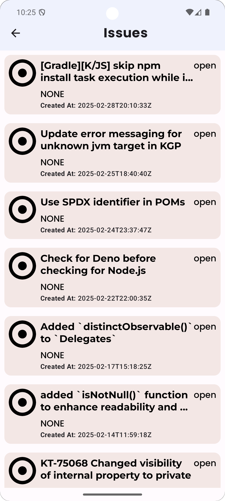
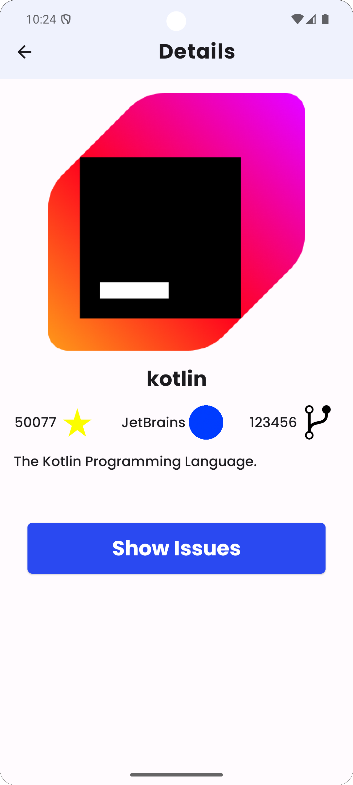

# 🧐**GitHub Trend Explorer project**  

### **Project Description**  
This Android application is being developed as part of the DEPI initiative. The goal is to create a platform to display popular GitHub repositories with essential details like stars, forks, and topics. The project aims to follow best practices for API integration and dynamic content rendering to provide an optimized user experience.

---

<!-- ### **Features**  
-   
  -    -->

---

## Technologies Used

- **Language:** Kotlin
- **Tools:** Android Studio, Compose.

---
#### App List Screen  

## Download all apps
[from here >>](https://drive.google.com/drive/folders/1k4AGk9gOIEfUT1yJBQRK8YOnPiovmFSR)

## Contact Me

If you have any questions, or if you’re interested in discussing Android development, feel free to reach out:

- [GitHub Profile](https://github.com/Abdallah-Alqiran)
- [LinkedIn](https://www.linkedin.com/in/abdallah-alqiran)
